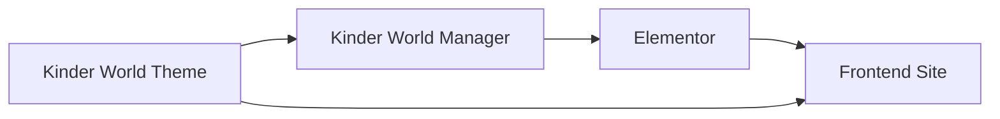

# Introduction

Welcome to the official documentation for **Kinder World** — a WordPress theme for kids and education websites, and its companion plugin **Kinder World Manager**.

## What is included?

| Product | Description |
|--------|-------------|
| **Kinder World Theme** | Underscores-based WordPress theme with Tailwind CSS, Bootstrap 5, custom header/nav, blog layouts, and page banners. |
| **Kinder World Manager** | Helper plugin that adds Elementor widgets, custom post types, theme builder (header/footer), CMB2 meta fields, and admin tools. |

## How they work together

- The **theme** provides the base layout, blog templates, default navigation, and Tailwind design tokens.
- The **plugin** powers Elementor page building, custom content types (Programs, Events, Courses, etc.), and can replace the theme header/footer via Theme Builder.
- Tailwind in the theme scans plugin Elementor widget PHP files so utility classes used in widgets compile correctly.

## Who is this documentation for?

- **Site owners** — installing and configuring the theme and plugin
- **Designers** — using Elementor widgets and Theme Builder
- **Developers** — extending CPTs, widgets, assets, and the build pipeline

## Quick links

- [Requirements](./getting-started/requirements)
- [Installation](./getting-started/installation)
- [Kinder World Manager Overview](./kinder-world-manager/overview)
- [Kinder World Theme Overview](./kinder-world-theme/overview)
