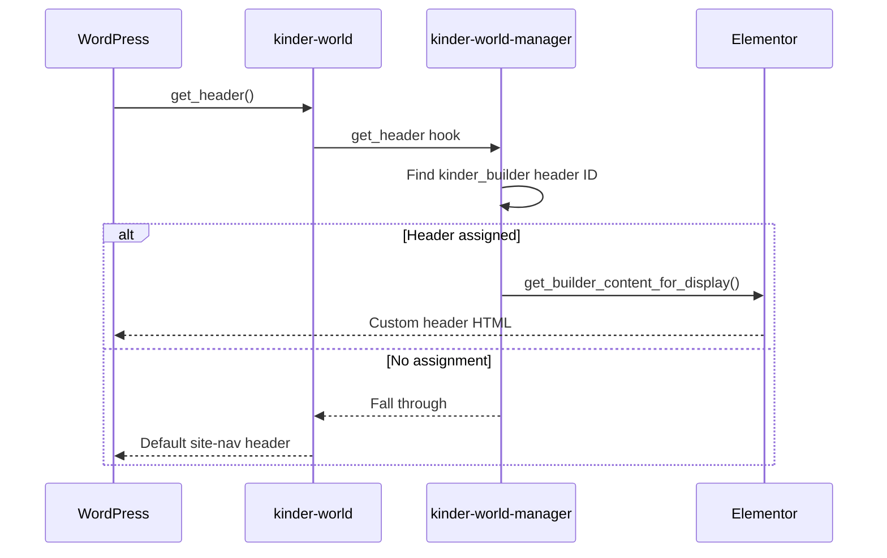

# Theme & Plugin Integration

Kinder World Theme and Kinder World Manager are designed to work as a pair.

## Responsibility split

| Concern | Theme | Manager plugin |
|---------|-------|----------------|
| Blog / archive layout | Yes | — |
| Default header / footer | Yes | Can replace via Theme Builder |
| Design tokens (Tailwind) | Yes | Uses theme utilities in widgets |
| Elementor widgets | — | Yes |
| CPTs (Program, Event, …) | — | Yes |
| CMB2 meta | — | Yes |
| Header/footer Elementor templates | — | Yes (`kinder_builder`) |

## Tailwind content scanning

Theme `tailwind.config.js` includes:

```js
"../../plugins/kinder-world-manager/includes/Elementor/*.php",
"../../plugins/kinder-world-manager/includes/Elementor/**/*.php",
```

After changing utility classes in plugin widgets, rebuild the theme:

```bash
cd wp-content/themes/kinder-world
npm run build
```

## Recommended setup order

1. Activate Elementor
2. Activate Kinder World Manager (`composer install`)
3. Activate Kinder World theme
4. Build theme assets if needed
5. Create Primary menu
6. Create Elementor pages with Kinder World Widgets
7. Optionally assign Theme Builder header/footer

## When Theme Builder is active



## Frontend asset overlap

Both theme and plugin register Slick/vendor-style assets in some cases. Prefer letting widgets enqueue only what they need, and avoid double-enqueuing the same library with different handles when customizing.

## Quick reference paths

| Item | Path |
|------|------|
| Theme | `wp-content/themes/kinder-world` |
| Plugin | `wp-content/plugins/kinder-world-manager` |
| Theme Tailwind config | `kinder-world/tailwind.config.js` |
| Plugin widgets | `kinder-world-manager/includes/Elementor/` |
| Theme Builder | `kinder-world-manager/includes/Themebuilder/` |
